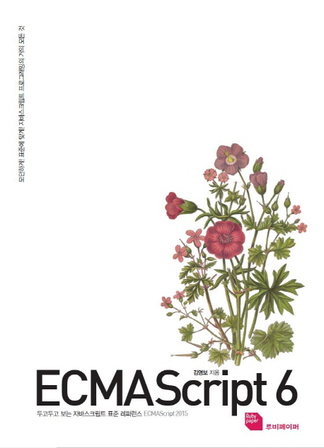
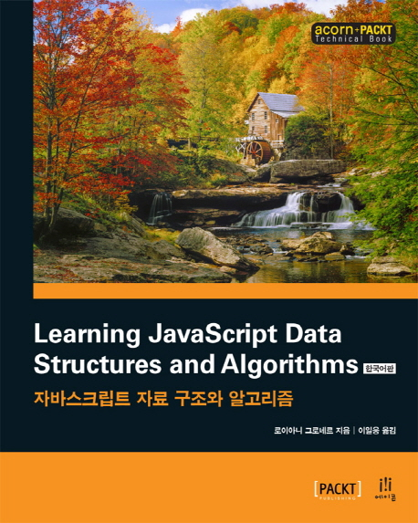
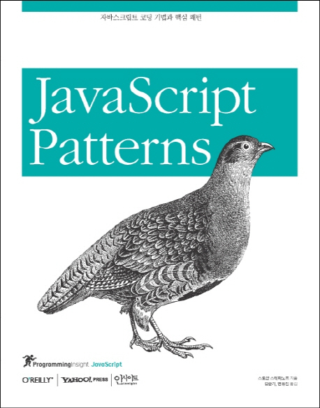

# 이덕희 (Lee Duck Hee)

Front-End Developer로 지원합니다.

  

## tech stack

classification | stack
--|--
language | javascript(es6), html, markdown
framework  | react
business tool | slack
tools | atom, vscdoe, editplus

## 신상정보

Profile | Content
--|--
Address | 서울특별시 도봉구 방학1동
Mobile  | 010-4909-7980
birth | 1987.08.12
e-mail | beatdance@naver.com
certification | 컴퓨터그래픽스운용기능사, 컴퓨터활용능력 2급

## 학력정보

Level | School Name | Major | Start | End | 최종학력
--|--|--|--|--|--
High school | Sunduck High school | Natural sciences  | 2006.02  | 2011.02  | 졸업
University| Korea National Open University(방송대) | Information statistics(정보통계학)  | 2014.09  | 2016.09  | 졸업

## 직장이력

Period | Company | Team
-|-|-|
2016.11~(9개월)| K2webtech(케이투웹테크)| Maintenance(유지보수)

## 업무 및 프로젝트

* 대학교(40여개) 및 관공서 홈페이지 유지보수
  * html, css, javscript 사용
  * Layout 깨짐 수정
  * 간단한 Photoshop, Text 수정

* 웹접근성 마크 갱신 작업
  * 인천장애인콜택시(2016.1)
  * 연암대학교(2017.3)
  * 이화여자대학교 게시판(퍼블리싱) 작업(2017.09)

---

**유지보수 업무 역할로 인해 프로젝트 구축 경험이 부족한 만큼 스터디를 통해 다른 부분들을 보완 및 향상했습니다.**

**카페, 카톡 단톡방, 지인 등을 통해 스터디를 만들고 꾸준하게 참여하고 있습니다.**

---

## 스터디

* **제목 : 초급 프론트엔드 개발 1기 과정 강의형 스터디 (하코사 - 김수호)**
* 기간 : 2016. 12. 11 ~ 02. 26 (매주 일요일 총 9주)
* 커리큘럼
  - 기초 자바스크립트(ES3)
  - 기초 자바스크립트(ES6+)
  - Ajax
  - Bootstrap 또는 Material Design Lite
  - Node.js
  - Webpack
  - Babel
  - ESLint
  - Handlebars
  - Jasmine
  - Git

* 정리 : HTML, CSS, jQuery 정도만 아는 수준에서 이 강의를 듣고 Front-End에 대한 첫 지식을 쌓을 수 있었습니다. Front-End 개발 전반적인 흐름을 알 수 있어 유익했고 공부할 방향성을 정할 수 있었습니다.

---

* **제목 : ES6 자율형 스터디**
* 기간 : 2017. 02 .13 ~ 06. 28 (매주 월요일)
* 교재 : ECMAScript 6 (두고두고 보는 자바스크립트 표준 레퍼런스)

* [github - 브랜치(duckhee)](https://github.com/shldhee/es6-study/tree/duckhee)
* 정리 : 추후 사용하게 될 React에 도움을 준 스터디입니다. ES6 전체적으로 한번 훑고 기본적인 것들을 숙지했습니다.

---

* **제목 : 자바스크립트 자료구조와 알고리즘 자율형 스터디**
* 기간 : 2017. 03. 18 ~ 06. 11 (매주 일요일)
* 교재 : 자바스크립트 자료구조와 알고리즘

* [github - shldhee folder](https://github.com/shldhee/bookStudy2)

* 정리 : 자바스크립트를 이용해 자료구조와 알고리즘을 공부했습니다. 비전공자로서 부족했던 부분들을 채울 수 있었고 여태까지 공부했던 것들이랑 다소 다른 느낌을 받았습니다. 이 계기로 업무 및 개발에 대한 시각이 바뀌고 흥미가 생긴 스터디였습니다.

---

* **제목 : ReactJS 기초부터 실전까지 - 5기 강의형 스터디 (하코사 - 고무곰(정재남))**
* 기간 : 2017. 04. 08 ~ 06. 03 (매주 토요일 총 10주)
* [github - 커리큘럼](https://github.com/shldhee/reactStudy)
* [todolist 실습 - 브랜치(duckhee)](https://github.com/react-study/playground-5)
* 정리 : 핫한 리액트를 배우고 프론트 개발자로 거듭나기 위해 스터디를 시작했습니다. 생각보다 쉽지 않은 리액트였습니다. 리액트 공부하면서 부족한 부분을 많이 알 수 있었습니다. 예를 들어, 자바스크립트 부족한 부분 (객체 복사 방법, 배열 메소드 등) 리액트를 혼자 구현할 정도로 배우진 못했지만, 자극을 받고 성장하는 계기가 되었습니다.

---

* **제목 : 자바스크립트 코딩 기법과 핵심 패턴 자율형 스터디**
* 기간 : 2017. 06. 18 ~ 09. 17 (매주 일요일)
* 교재 : 자바스크립트 코딩 기법과 핵심 패턴

* [github정리](https://github.com/shldhee/javascript-pattern-study)
* 정리 : 자바스크립트를 실무에서 효율적으로 사용하려고 스터디를 시작했습니다. 책이 오래전에 출판했고 개정판이 나오지 않아 현업에서 사용하지 않은 것들을 알려줘서 아쉬움이 많은 책이었습니다.
---
